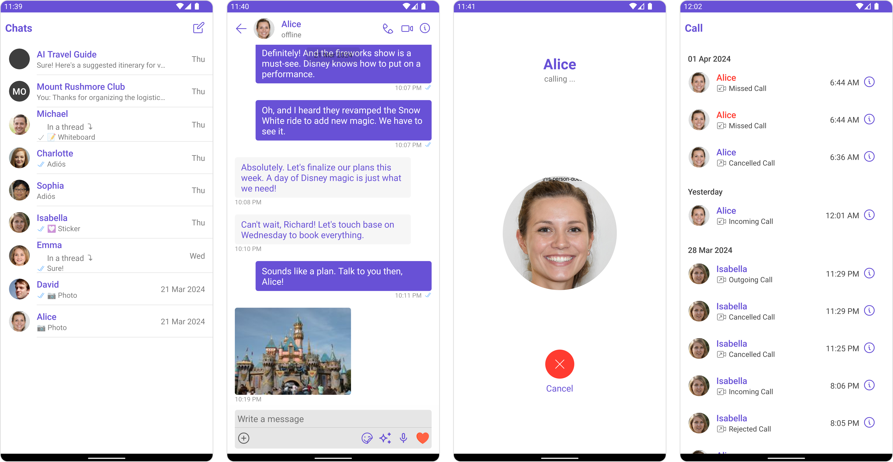

<p align="center">
  
</p>

# Android Sample App by CometChat

This is a reference application showcasing the integration of [CometChat's Android UI Kit](https://www.cometchat.com/docs/v4/android-uikit/overview) within an Android framework. It provides developers with examples of implementing real-time messaging and voice and video calling features in their own Android-based applications.

<div style="
    display: flex;
    align-items: center;
    justify-content: center;">
   
</div>

## Prerequisites

- Android Studio
- Android Device or emulator with Android version 6.0 or above.
- Java 8 or above.
- Sign up for a [CometChat](https://app.cometchat.com/) account to get your app credentials: _`App ID`_, _`Region`_, and _`Auth Key`_


## Installation
1. Clone the repository:
    ```
    git clone https://github.com/cometchat/cometchat-sample-app-android-java.git
    ```
2. In Android Studio, open the project cometchat-sample-app-android-java

3. Enter your CometChat _`App ID`_, _`Region`_, and _`Auth Key`_ in the [AppConstants.java](https://github.com/cometchat/cometchat-sample-app-android-java/blob/v4/app/src/main/java/com/cometchat/javasampleapp/AppConstants.java) file:
   https://github.com/cometchat/cometchat-sample-app-android-java/blob/2d631e56f9e596857e18838f1032ef1cf428f890/app/src/main/java/com/cometchat/javasampleapp/AppConstants.java#L3-L11

4.  If your app is created before August 12th, 2024 then change the sample data URL to `https://assets.cometchat.io/sampleapp/v1/sampledata.json` in the [app/src/main/java/com/cometchat/javasampleapp/constants/StringConstants.java](https://github.com/cometchat/cometchat-sample-app-android-java/blob/v4/app/src/main/java/com/cometchat/javasampleapp/constants/StringConstants.java) file: https://github.com/cometchat/cometchat-sample-app-android-java/blob/056b60f4b8092a6a24df64e371e56879bbb77915/app/src/main/java/com/cometchat/javasampleapp/constants/StringConstants.java#L12-L14

5. Run the app on a device or emulator.


## Help and Support
For issues running the project or integrating with our UI Kits, consult our [documentation](https://www.cometchat.com/docs/android-uikit/integration) or create a [support ticket](https://help.cometchat.com/hc/en-us) or seek real-time support via the [CometChat Dashboard](http://app.cometchat.com/).
