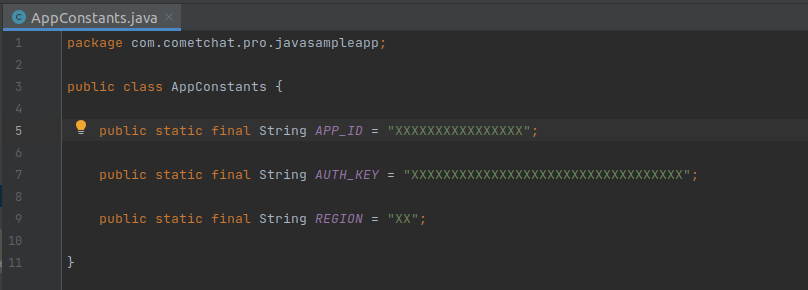

	

		

         
		
	
	
	

# Android Java Chat App

 

CometChat Pluto Sample App (built using CometChat UIKit) is a fully functional messaging app capable of one-on-one (private) and group messaging . This sample app enables users to send text and multimedia messages like images, videos, documents.**
 

## Prerequisites :star:
Before you begin, ensure you have met the following requirements: 
✅ &nbsp; You have `Android Studio` installed in your machine. 
✅ &nbsp; You have a `Android Device or Emulator` with Android Version 6.0 or above. 
✅ &nbsp; You have read [CometChat Key Concepts](https://www.cometchat.com/docs/pluto-java-beta/key-concepts). 

## Installing Android Java Chat Pluto UI Kit :wrench:

Simply clone the project from [android-java-chat-pluto-uikit](https://github.com/cometchat-pro/android-java-chat-app/tree/pluto) repository.

### Running the sample app

To Run to sample app you have to do the following changes by Adding **APP_ID**, **AUTH_KEY** and  **REGION_CODE**

You can obtain your  *APP_ID*, *AUTH_KEY* and *REGION_CODE* from [CometChat-Pro Dashboard](https://app.cometchat.io/)

- Open the project in Android Studio.

- Modify `APP_ID` and `AUTH_KEY` and `REGION` with your own .

-  Select demo users or enter the **UID** at the time of login once the app is launched.

Build and run the Sample App.

# Learn more about UI-Kit

Learn more about how to integrate [Pluto UI Kit](https://www.cometchat.com/docs/pluto-java-beta/integration) inside your app.
 

## Troubleshooting

- To read the full documentation on UI Kit integration visit our [Documentation](https://www.cometchat.com/docs/pluto-java-beta/overview)  .

- Facing any issues while integrating or installing the UI Kit please <a href="https://app.cometchat.io/"> connect with us via real time support present in CometChat Dashboard.</a>.

---

## Contributors

Thanks to the following people who have contributed to this project:

[👨‍💻 @vivekprajapati 💻](https://github.com/vivekCometChat)

[Contribution guidelines for this project]()

---

## :mailbox: Contact

Contact us via real time support present in [CometChat Dashboard.](https://app.cometchat.io/)

---

## License

This project uses the following license: [License.md](LICENSE).

